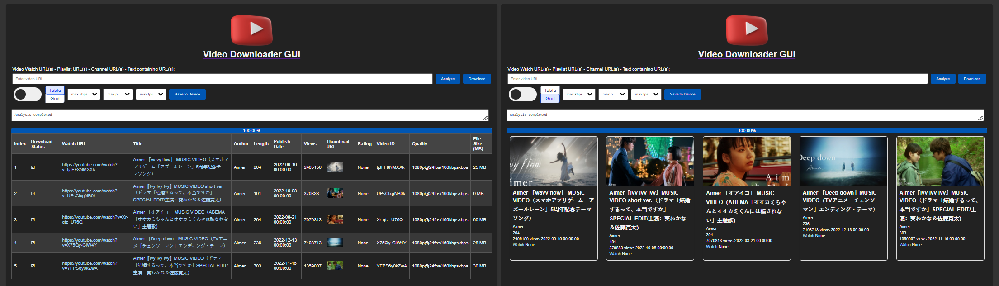

<p align="center">
  
  <h1 align="center">Youtube Downloader Deluxe</h1>
</p>

**Youtube Downloader Deluxe** is a powerful and feature-rich software that allows you to easily download your favorite YouTube videos. With its user-friendly interface and advanced capabilities, it stands out as one of the best YouTube downloaders available today.

Desktop verion:


Web application/ Docker web-application version:


Mobile application version:


+++ TODO: put an image here of the mobile application

## Features

- Intuitive and easy-to-use graphical interface
- Supports downloading videos in various formats (MP4, WebM, etc.) and outputs in matroska MKV
- Allows downloading as a separate file: audio streams (MP3, OGG, etc.), the video streams(MP4, WebM, etc.)
- Also Supports downloading  subtitles, thumbnails, comments, info and description metadata as separate files
- Preview a selection of videos before downloading via your local video player (feature supported by Global Potplayer - Daum  https://potplayer.daum.net/)
- Multithreaded video analysis and download procedures
- Compatible with YouTube watch links, playlists, YouTube channel URLs and extraction of sub-links from non-YouTube webpages.
- Integration with the Google API for additional functionality
- Progress tracking and cancellation options, ability to sort the YouTube video info(s) according to the information columns which can be hidden as well
- Shortcut key combinations available, and ability to copy the table meta data as pain text
- Global quality limiters and per-video download quality selection
- Regular updates and improvements
- Can work in Windowed GUI mode and non-gui mode from the command line
- Can integrate with external software for stream muxing and transcoding and editing

## Setup and Execution Guide

This guide walks you through the steps to set up and run the project. It is recommended to use a virtual environment for this setup to ensure that the dependencies of the project do not interfere with other Python projects or system-wide Python packages.

### Step 1: Creating a Virtual Environment

A virtual environment is an isolated Python environment that allows you to manage dependencies for different projects separately. To create a virtual environment, follow these steps or use a tool such as your IDE:

1. **Navigate to your project's root directory**:
   ```bash
   cd download/path/to/YoutubeVideoDownloader
   ```

2. **Create a Virtual Environment**:
   - For **Windows**, use:
     ```bash
     python -m venv .venv
     ```
   - For **macOS and Linux**, use:
     ```bash
     python3 -m venv .venv
     ```

3. **Activate the Virtual Environment**:
   - On **Windows**, run:
     ```bash
     .\.venv\Scripts\activate
     ```
   - On **macOS and Linux**, run:
     ```bash
     source .venv/bin/activate
     ```
   You will know that the virtual environment is activated as the name of the virtual environment (.venv) will appear on your terminal prompt.

### Step 2: Installing Dependencies
With the virtual environment activated, install all the required dependencies listed in `versioned_requirements.txt`:

```bash
pip install -r versioned_requirements.txt
```
This command will install the exact versions of the dependencies required for the project.\
It may also be ncessary to install FFMPEG. 
In **Linux** you can run the command:
```bash
sudo apt-get update && apt-get install -y ffmpeg
```
or download the binaries for your system from http://ffmpeg.org.

### Step 3: Making an executable package on your platform
Once all dependencies are installed, you can run the `make.py` script:

```bash
python make.py
```
Or on some systems, you might need to use:

```bash
python3 make.py
```
This will execute the script and perform the make and packaging tasks defined in `make.py`.

### Step 4: Running the Script
* If you have ran "Step 3" then you can use the produced executable:
  *  YouTubeDownloader.exe for Windows
  *  YouTubeDownloader for Linux.
* A zip package is also produced for portable use with all necessary files.
* You can open it graphically or from the terminal. 
  * From the terminal you can start it as a command line tool or in GUI mode with a flag. 
  * You can also use it as a web application or cloud application and serve it via a webpage.
* You can also run all those options directly from python without "Step 3" from terminal or IDE. For easy quick start run:
  ```bash
  python run_app_gui.py # will run the GUI by default.
  ```
  You can also run the actual starting point from inside src.
  ```bash
  python ./src/YouTubeDownloader.py
  ```
### Additional Notes

- **Deactivating the Virtual Environment**: To exit the virtual environment, simply run `deactivate` in your terminal. This will revert to your global Python environment.
- **Reactivating**: To work on your project again after deactivating, navigate to your project directory and activate the virtual environment as shown in Step 1.

### Step 5: Docker deployment
The application can also be run as a docker container.
To build the docker container, from the project directory you can run: 
```bash
docker build -t youtube-downloader .
```
When built to execute the docker container, you can run:
```bash
docker run -p 8080:8080 -v ~/youtube_download_tmp:/app/tmp --name youtube-downloader-container youtube-downloader
```

---
Alternativley you can use the docker compose file with with optionally detached mode "-d"
```bash
docker-compose up --build -d
```
# Installation Guide for Compiling Kivy Application for Android

This guide provides detailed instructions on setting up your environment to compile a Kivy application for Android.

## Prerequisites

Before you begin, ensure you have the following installed:

- **Python**: Python 3.x is required. Download and install from [python.org](https://www.python.org/downloads/).
- **Kivy**: Install Kivy following the instructions on the [Kivy website](https://kivy.org/doc/stable/gettingstarted/installation.html).
- **Java Development Kit (JDK)**: JDK 8 is required. You can install it on Ubuntu using `sudo apt install openjdk-8-jre-headless`.
- **Android SDK and NDK**: These will be downloaded automatically by Buildozer, but you can also install them manually if preferred.
- **Cython**: Required for compiling Python into C. Install via pip with `pip install Cython`.
- **Buildozer**: Install Buildozer via pip with `pip install buildozer`.


## Mobile app deployment

### Setting Up the Environment
1. **Install Java Development Kit (JDK)**:
    ```bash
    sudo apt install openjdk-17-jre-headless
    ```
2. **Install Additional Dependencies in the Virtual Environment**:
    ```bash
    pip install kivy
    pip install buildozer
    pip install Cython
    ```
3. **Configure Buildozer**:
  * Navigate to your project directory.
  * Run buildozer init to create a buildozer.spec file.
  * Edit the buildozer.spec file to configure your build.
4. **Compile the Application**:
   ```bash
   buildozer -v android debug
   ```
### Troubleshooting

- If you encounter any issues with installation, check the official documentation of each tool or consult their respective communities.
- Ensure your `PATH` variable includes Python and Java paths.
- For common issues with Kivy or Buildozer, refer to their FAQs or community forums.

### Additional Resources

- [Kivy Documentation](https://kivy.org/doc/stable/)
- [Buildozer GitHub Repository](https://github.com/kivy/buildozer)


## Current State of Development TODO(s)

[//]: # (Add the current state of things section here when content is provided)
- [ ] There are various TODO notes in the coded related to implementation of features and bugfixes.

- [ ] Optional: URL scraping from YouTube Channel URLs
- [ ] Optional: It would be good to have some testing, meaning automated testing procedures during build time.
- [ ] Optional: Per video quality stream selection no yet implemented. (only global limiters available at the moment)
This could be with a selection and a button to transfer the limits.
- [ ] Finish the "keep file" functionality for subtitle and comments. This appears to be a bit more tricky as it requires different sort of APIs. 
- [ ] Optional: Better progress reporting and percentage for download progress implementation.
This is relevant when there are a lot of links/text/channels inserted at the same time.
	- Download reporting is ok but not too detailed.
	- Analysis reporting could do much better. 

- [x] Improve multithreading and parallel downloads. In this case some limiters on the number of threads would be good.
- [ ] The settings sub-window needs to be implemented. Currently it is in embryonic state. 
  - In the settings window the user will be able to select, themes languages, paths, shortcut combinations etc.
  - Column order can also be implemented in the Settings and as drag and drop option.
- [x] Redesign of the web based UI.
  * In particular the client-server interaction.
  * Currently there is no form of socketing or synchronized update in web-mode.
- [ ] User sessions or some form of per user separation could be considered for multiuser mode. 
- [ ] Final file size reporting should be corrected and make more accurate and reflect the latest changes.
- [ ] Better error handling, proper cancellation (and clean-up) and abrupt exit thread handling and clean-up should be implemented (especially for the windowed GUI mode).

- [ ] Bugfix: Sometimes not all videos are properly extracted from a playlist. 
  * This is due to video restrictions which require login. Maybe we could consider some form of sign. 
- [ ] There should be a LOG file option in the settings menu
- [ ] The cancel operation should be revaluated. Any bugs should be fixed for both download and analysis. Note: it works for single threaded downloads but ones the threads are initialized in the multithreaded mode there is no convenient way to stop them until they are finished. (aside from hard stop. In that case a post cleanup will have to be done somehow.)
- [ ] Web: Currently there is no cancel option for the web version.
- [ ] Web: Bug: In the web UI the theme button doesn't initializes from the same position for every theme upon reload when state is acquired from the server
- [ ] TODO: The licence comment in the files has to be completed. Author info & specific file name have to be altered.
- [ ] Web: Maybe add individual buttons for local download. Those could be added in the context menu potentially. Along with that perhaps include a field for specifying the local download location.
- [ ] Web: After the analysis is done maybe clear the analysis bar from the text.
- [ ] Web: for convenience the context menus can be made be duplicated as a side panel for mobile devices for example.
- [ ] Web: Maybe do a multi-user mode with with a simple database. Even a serverless SQL database would work. We can use ORM to get/set simple user configuration info.  That would also include IP recognition as well or alternatively we can have user/password or simply user/device name option. 

- [ ] Try android version with Kiwi
- [ ] TODO: the readme should be updated and cleaned up.

## Potential Features
- [ ] Webpage/Forum or some kind of marketing strategy for outreach to more users
- [ ] Add support for more video platforms
- [ ] Improve error handling and reporting
- [ ] Create a user guide and documentation
- [ ] Optimize performance and resource usage
	- [x] Some parts about startup were optimized. But still not the best
- [ ] Expand language support
- [ ] Add user customization options (themes, settings, etc.) made more accessible.
- [ ] Implement automatic updates and version checking
- [ ] Resilience for errors/corruption in Theme and config file on startup
- [ ] Error & Bug reporting
- [ ] Use sub-directory for the channels and playlists